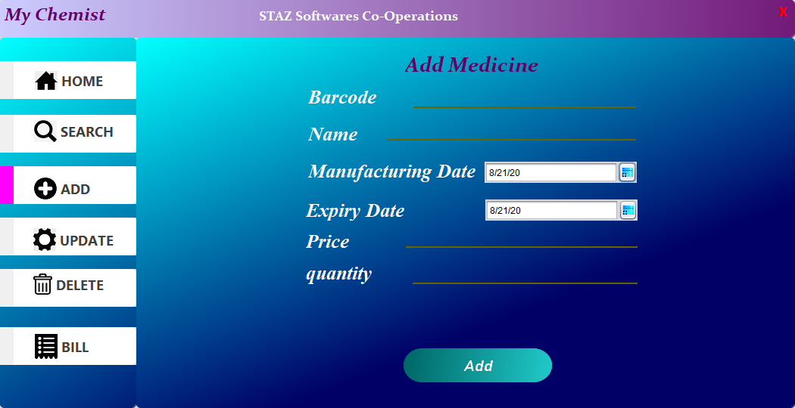

# Chemist-Software (DESKTOP APPLICATION USING JAVA NETBEANS 8.0.2 and MySQl 8.0.20)
## Developers Name :
### Front End : Amaan Diwan(~JC) and Tanveer Shaikh(tancred shaikh)
### Back End : Tanveer Shaikh(tancred shaikh) and Zeeshan Mansoori
### Co-operate Developer : Saqib Bagwan(Sakibroxx) and Swapnil Patel(swappy)
***This Software is Mini-Project of Second Year BscCS student which is develped by 5 Students of Bhavans College,Mumbai,India in the year 2019-2020***

## Important NOTE
**First You need to add all jar file to netbeans libaray Chemist-Software/ADD THIS JAR TO LIBRARY BEFORE RUNNING JAVA NETBEANS.IF YOU WILL NOT ADD THIS YOU FACE ERRORS**

## SIGN IN PAGE

## SIGN UP PAGE

## HOME PAGE

## SEARCH PAGE

## ADD PAGE

## UPDATE PAGE

## DELETE PAGE

## BILL PAGE

## DATABASE FOR USERNAME AND PASSWORD

